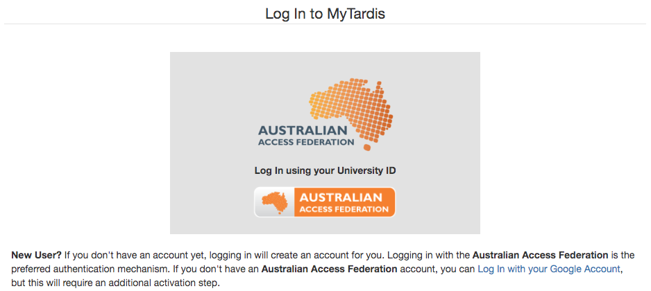

# MyTardis AAF Google Login

Adds a login view to [MyTardis](https://github.com/mytardis/mytardis) which
allows users to log in with 
[Australian Access Federation](https://aaf.edu.au/about/)
or [Google OAuth](https://developers.google.com/identity/protocols/OAuth2) via
[OpenID Connect](https://openid.net/connect/).



## Installation

These instructions assume that you have installed and configured MyTardis.
If you haven't please follow the instructions in the latest [MyTardis documentation](https://mytardis.readthedocs.io/en/develop/admin/install.html).

Install the latest version of the `mytardis-aaf-google-login` app:

```
pip install git+https://github.com/jameswettenhall/mytardis-aaf-google-login@master#egg=aaf_google_login
```

If you using a virtualenv, remember to activate it first.

Add the following to your MyTardis settings file eg. `/path/to/mytardis/tardis/settings.py`:

Add `aaf_google_login` to your `INSTALLED_APPS`:

```
INSTALLED_APPS = INSTALLED_APPS + (
    'aaf_google_login'
)
```

Also in your MyTardis settings, override the login view:

```
LOGIN_VIEWS = {
    1: 'aaf_google_login.views.LoginView'
}
```

For more information on overriding MyTardis's login view, see:
<https://mytardis.readthedocs.io/en/develop/apps/contextual_views.html#custom-login-view>
